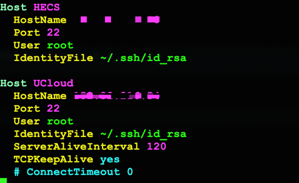
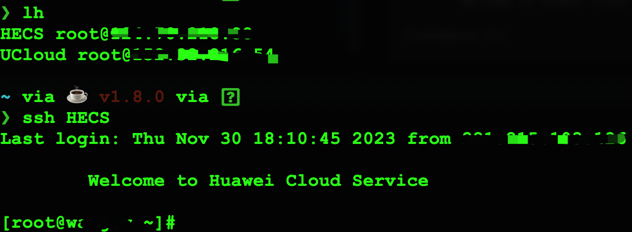

# ssh-config-ls
mac上的列举 ~/.ssh/config 中已知host，使用自带终端替代shell工具，免除安装、破解。

### 使用环境  
```
Python 3.11.5
Darwin Kernel Version 22.5.0:
```
### 添加已知host

```shell
vim ~/.ssh/config
```
#### eg.


```shell
Host HECS
  HostName 1.1.1.1
  Port 22
  User root
  IdentityFile ~/.ssh/id_rsa

Host UCloud
  HostName 2.2.2.2
  Port 22
  User root
  IdentityFile ~/.ssh/id_rsa
  ServerAliveInterval 120
  TCPKeepAlive yes
  # ConnectTimeout 0
```

### 建立互信

```shell
mkdir  ~/.ssh
chmod -R 600  ~/.ssh
ssh-keygen -t rsa  # 一路回车，直至提示结束

ssh-copy-id -i ~/.ssh/id_rsa.pub ${server1}@${host1}
ssh-copy-id -i ~/.ssh/id_rsa.pub ${server2}@${host2}
# 此处 server1、host1、server2、host2请更换成~/.ssh/config添加的信息，按提示输入密码
```

### 下载文件
```shell
gitclone https://github.com/redgreat/ssh-config-ls.git
cd ssh-config-ls
cp pc.py ~/.ssh/
```

### 添加别名

```shell
vim ~/.zshrc # 或者shell配置文件

# 添加
alias lh='/opt/homebrew/bin/python3 ~/.ssh/pc.py'

source ~/.zshrc
```

### 使用

```shell
❯ lh
HECS root@1.1.1.1
UCloud root@2.2.2.2

❯ ssh HECS
Last login: Thu Nov 30 18:10:45 2023 from 1.1.1.1
	
	Welcome to Huawei Cloud Service

[root@xxxx ~]#  
```



